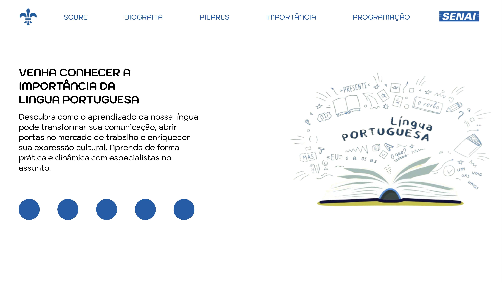
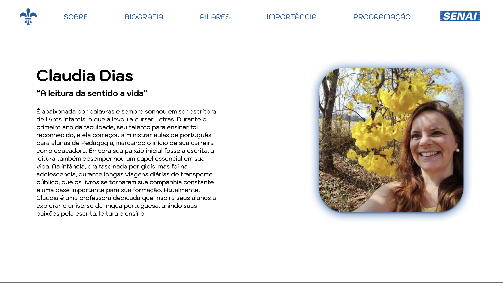
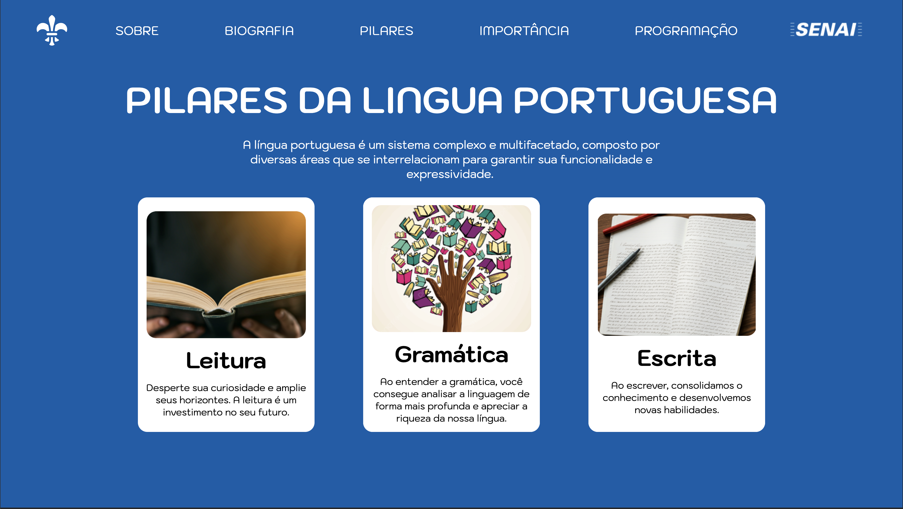
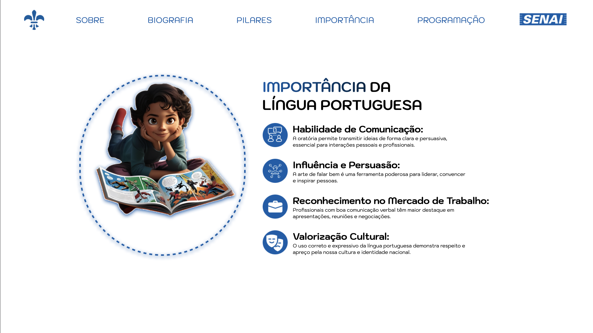
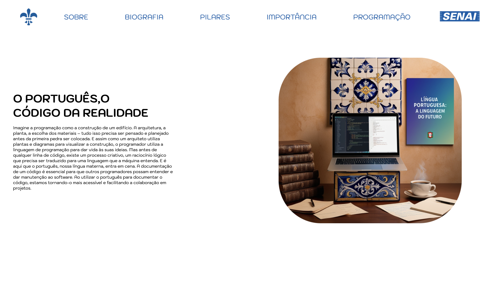

# LinguaPortuguesa-Avaliacao

---

## Sobre

O projeto final de front-end tem como objetivo a criação de um site do tipo landing page responsivo para divulgar a matéria de lingua portuguesa. Esse projeto foi desenvolvido pelos integrantes Israel Junior, Daniel Torres e Pedro Henrique, com foco na aplicação dos conhecimentos adquiridos ao longo do curso de Desenvolvimento de Sistemas no [SENAI JANDIRA](https://sp.senai.br/unidade/jandira).

A importância desse projeto reside na oportunidade de consolidar o aprendizado das principais linguagens de marcação, como HTML e CSS, além de integrar conceitos de design responsivo e otimização de performance. Cada integrante assumiu a responsabilidade de colaborar no planejamento, execução e revisão do código, com o intuito de garantir uma experiência de usuário intuitiva e visualmente atraente. O projeto reflete a aplicação prática de conteúdos teóricos, sendo uma peça fundamental para o desenvolvimento das habilidades de front-end de todos os participantes.

---

## Tecnologias utilizadas
- HTML
- CSS
- JAVASCRIPT
- MARKDOWN
- GIT

## Autores
- Israel Junior
- Daniel Torres
- Pedro Henrique